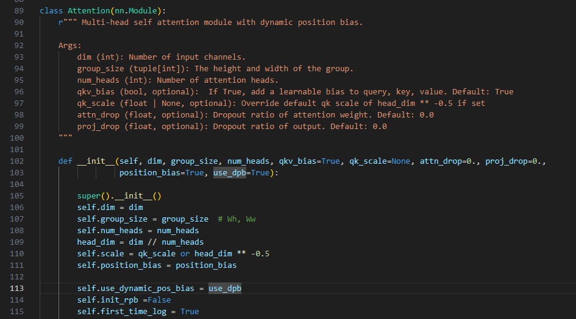
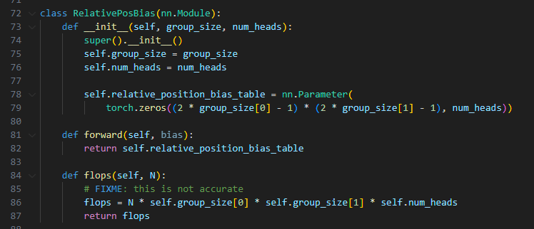
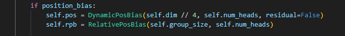
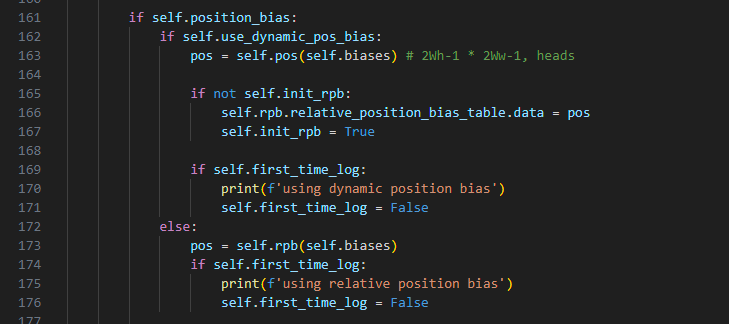
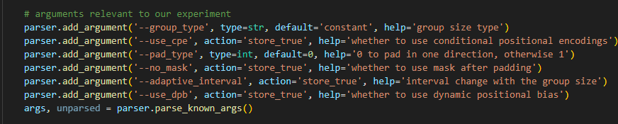
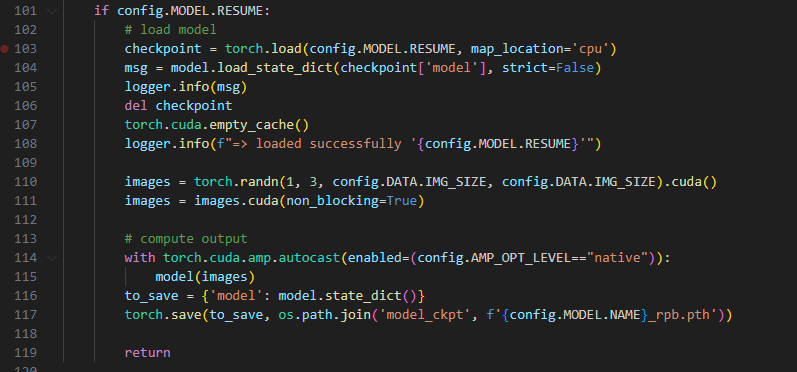

# 作业3: 视觉Transformer中的位置表征
## 1. 阅读CrossFormer论文及代码,了解其中的动态位置偏置(DPB)模块,解释为什么在输入图像大小固定时, DPB与Swin Transformer相对位置偏置(RPB)等价.
Swin Transformer中的相对位置偏置(RPB)是固定大小可学习的参数表格,在测试阶段根据相应的位置偏置在参数表格中检索对应位置编码；CrossFormer中的动态位置偏置(DPB)将位置偏置输入到一个网络中,使用网络预测对应的位置编码.当输入图像大小固定时,相对位置偏置中的参数表格等价于所有位置偏置经过动态位置偏置网络的输出.

举例说明,对于高度为2,宽度为2,num_head为1的输入图像,其位置偏置分别为
[[-1,-1], [-1,0], [-1,1], [0,-1], [0,0], [0,1],[1,-1], [1,0], [1,1]],
Swin Transformer会维护一个形状为[9, 1]的表格table,表格中的第一个数据table[0][0]对应[-1,-1]的位置编码,训练阶段会不断更新表格中的参数,推理阶段根据位置偏置在表格中检索对应位置编码.

而对于CrossFormer,其设计了一个网络,由线性层,layernorm和relu组成,训练阶段更新网络中的参数,将[-1,-1]这个位置偏置输入到网络中即得到对应的位置编码. 将这九个位置偏置的位置编码进行拼接即得到相对位置偏置模块中的表格.

## 2. 下载CrossFormer源码和任意一个预训练模型，假设输入图像大小恒定为224×224224×224（ImageNet常用图像大小），将训练好的DPB转化为RPB，并在ImageNet验证集测试上测试转换后的模型的精度。简要说明代码和模型pth文件转换逻辑修改逻辑。

### 代码和模型修改逻辑
1. 给CrossForm.py文件中类添加属性
- self.use_dynamic_pos_bias: 表明是否使用动态位置偏置,为True时使用动态位置偏置,为False使用相对位置偏置
- self.init_rpb: 用于给相对位置偏置赋值,为True时给相对位置偏置赋值,为False时不赋值
- self.first_time_log: 用于在推理第一个batch图片时打印使用哪种偏置



2. 定义相对位置偏置类
RelativePosBias类中包含一个偏置表



3. 给Attention类添加rpb属性



4. 修改Attention forward函数
当self.use_dynamic_pos_bias设置为true时,pos设置为动态位置,并将动态位置偏置网络的输出赋值给相对位置编码,整个过程相对位置偏置不参与运算,仅用于保存新的权重.

当self.use_dynamic_pos_bias设置为false时,pos设置为相对位置偏置,整个前向过程则不包括动态位置偏置.



5. 在main.py添加参数, use_dpb,该参数通过以下链路传给Attention类.


```
CrossFormer -> Stage -> CrossFormerBlock -> Attention
```

6. 新写一个save_rpb_weight.py类,执行一次前向过程, 保存相对位置偏置权重到`model_ckpt`目录下.



此时,模型权重已转换完成.

7. 模型推理验证精度, 执行以下指令
```
# inference with dpb weight
python -u -m torch.distributed.launch --nproc_per_node 1 main.py --cfg configs/crossformer/tiny_patch4_group7_224.yaml \
--batch-size 128 --data-path /home1/yanweicai/DATA/tta/clip_based_adaptation/imagenet --eval --resume ./model_ckpt/crossformer-t.pth --use_dpb

# inference with rpb weight
python -u -m torch.distributed.launch --nproc_per_node 1 main.py --cfg configs/crossformer/tiny_patch4_group7_224.yaml \
--batch-size 128 --data-path /home1/yanweicai/DATA/tta/clip_based_adaptation/imagenet --eval --resume ./model_ckpt/cros_tiny_patch4_group7_224_rpb.pth 
```
日志文件分别保存在